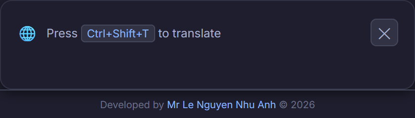
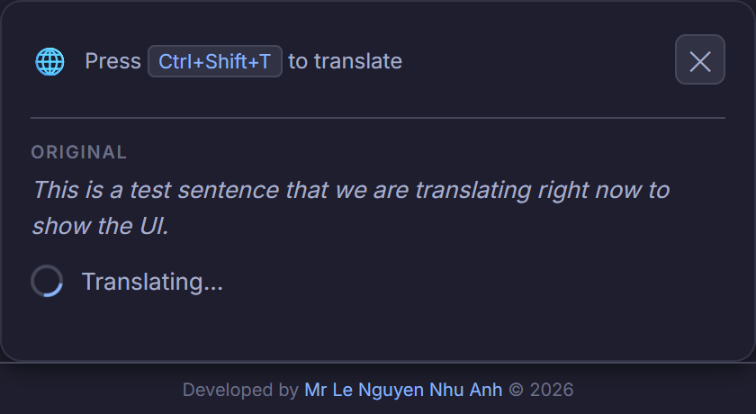
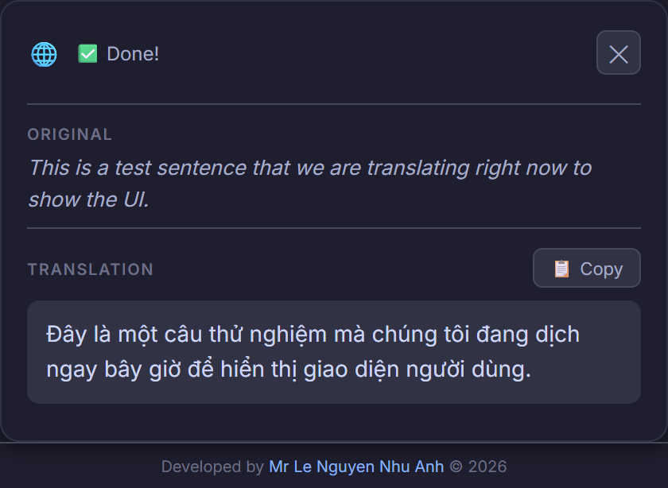
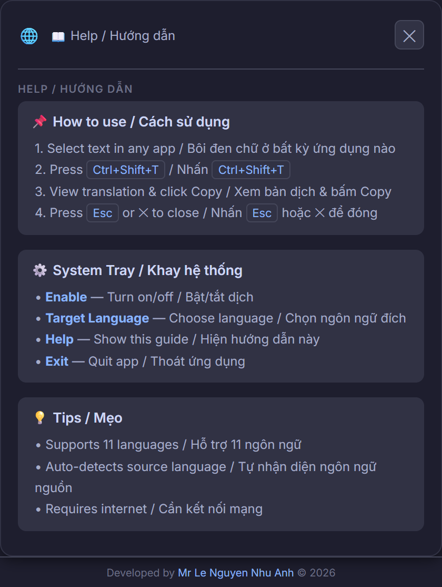
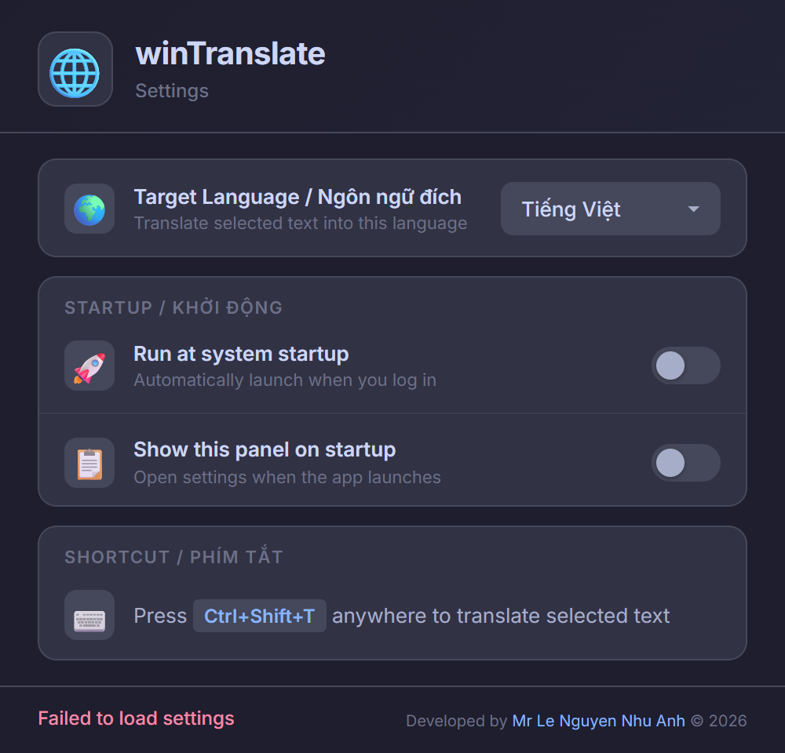

# winTranslate — Tauri v2

> Cross-platform system-wide translation app built with Tauri v2 (Rust + WebView2).
>
> Ứng dụng dịch toàn hệ thống đa nền tảng, xây dựng bằng Tauri v2 (Rust + WebView2).

---

## ✨ Features / Tính năng

- ⌨️ **Global Hotkey** — `Ctrl+Shift+T` (Win) / `Cmd+Shift+T` (Mac)
- 🌐 **Auto-detect source language** — Tự nhận diện ngôn ngữ nguồn
- 🎯 **11 target languages** — VI, EN, ZH, JA, KO, FR, DE, ES, TH, RU, ZH-TW
- 🖥️ **System tray** — Enable/disable, language selection, help
- 🎨 **Dark theme** — Catppuccin Mocha + Inter font
- 📦 **Lightweight** — ~4 MB installer

---

## 📸 Screenshots / Giao diện

<div align="center">
  
  <br/>
  <em>Global translation popup / Cửa sổ dịch toàn cầu</em>
</div>

<br/>

<div align="center">
  
  <br/>
  <em>Translating in progress / Đang dịch...</em>
</div>

<br/>

<div align="center">
  
  <br/>
  <em>Translation result / Kết quả dịch</em>
</div>

<br/>

<div align="center">
  
  <br/>
  <em>Help & Usage guide / Hướng dẫn sử dụng</em>
</div>

<br/>

<div align="center">
  
  <br/>
  <em>Application Settings / Cài đặt ứng dụng</em>
</div>

---

## 🔧 Prerequisites / Yêu cầu

### All Platforms / Tất cả nền tảng
- [Rust](https://rustup.rs/) (1.75+)
- [Node.js](https://nodejs.org/) (18+)

### Windows
- [WebView2 Runtime](https://developer.microsoft.com/en-us/microsoft-edge/webview2/) (usually pre-installed on Win 10/11)
- [Visual Studio C++ Build Tools](https://visualstudio.microsoft.com/visual-cpp-build-tools/)

### macOS
- Xcode Command Line Tools:
  ```bash
  xcode-select --install
  ```
- macOS 10.15+ (Catalina or later)

---

## 🚀 Development / Phát triển

```bash
# Clone repo
git clone https://github.com/nguyennhuanhle/winTranslate.git
cd winTranslate/tauri-app

# Install JS dependencies
npm install

# Run in dev mode (hot-reload)
npm run tauri dev
```

---

## 📦 Build Installers / Build bản cài đặt

### Windows (on Windows)

```bash
npm run tauri build
```

**Output:**
- `src-tauri/target/release/bundle/nsis/winTranslate_*_x64-setup.exe` — NSIS installer
- `src-tauri/target/release/bundle/msi/winTranslate_*_x64_en-US.msi` — MSI installer

### macOS (on macOS)

```bash
# Install prerequisites
xcode-select --install
curl --proto '=https' --tlsv1.2 -sSf https://sh.rustup.rs | sh
source $HOME/.cargo/env

# Clone & build
git clone https://github.com/nguyennhuanhle/winTranslate.git
cd winTranslate/tauri-app
npm install
npm run tauri build
```

**Output:**
- `src-tauri/target/release/bundle/dmg/winTranslate_*.dmg` — DMG installer
- `src-tauri/target/release/bundle/macos/winTranslate.app` — App bundle

> **⚠️ macOS Note:** First launch → System Settings → Privacy & Security → Accessibility → Enable winTranslate. This is required for the global hotkey and auto-copy features.

### Cross-Platform via GitHub Actions (CI/CD)

Create `.github/workflows/release.yml` to auto-build for both platforms:

```yaml
name: Release

on:
  push:
    tags: ['v*']

jobs:
  build:
    strategy:
      matrix:
        include:
          - os: windows-latest
            target: x86_64-pc-windows-msvc
          - os: macos-latest
            target: aarch64-apple-darwin

    runs-on: ${{ matrix.os }}

    steps:
      - uses: actions/checkout@v4

      - name: Setup Node.js
        uses: actions/setup-node@v4
        with:
          node-version: 20

      - name: Setup Rust
        uses: dtolnay/rust-toolchain@stable

      - name: Install dependencies
        working-directory: tauri-app
        run: npm install

      - name: Build Tauri
        uses: tauri-apps/tauri-action@v0
        with:
          projectPath: tauri-app
          tagName: ${{ github.ref_name }}
          releaseName: 'winTranslate ${{ github.ref_name }}'
          releaseBody: 'See the assets below for download.'
          releaseDraft: false
          prerelease: false
```

**Usage:** Push a tag → GitHub Actions builds both platforms → Adds installers to Release.
```bash
git tag v2.0.0
git push origin v2.0.0
```

---

## 📁 Structure / Cấu trúc

```
tauri-app/
├── src/                        # Frontend
│   ├── index.html              # Popup HTML structure
│   ├── styles.css              # Catppuccin dark theme
│   └── main.js                 # Event handlers, resize, translate
├── src-tauri/                  # Rust backend
│   ├── src/
│   │   ├── lib.rs              # Tray, hotkeys, window management
│   │   ├── translate.rs        # Google Translate API client
│   │   └── main.rs             # Entry point
│   ├── icons/                  # App icons (all sizes)
│   ├── capabilities/           # Tauri permissions
│   ├── Cargo.toml              # Rust dependencies
│   └── tauri.conf.json         # Tauri configuration
└── package.json                # Node.js dependencies
```

---

## 🔑 Key Dependencies / Thư viện chính

| Crate/Plugin | Purpose |
|---|---|
| `tauri` v2 | App framework, window, tray |
| `tauri-plugin-global-shortcut` | System-wide hotkey |
| `tauri-plugin-clipboard-manager` | Read/write clipboard |
| `tauri-plugin-http` | Google Translate API |
| `enigo` | Simulate Ctrl+C keystroke |
| `reqwest` | HTTP client |
| `urlencoding` | URL-encode text |

---

## 👨‍💻 Author / Tác giả

**Mr Le Nguyen Nhu Anh** — [edtechcorner.com](https://edtechcorner.com/) © 2026

## 📄 License

MIT
